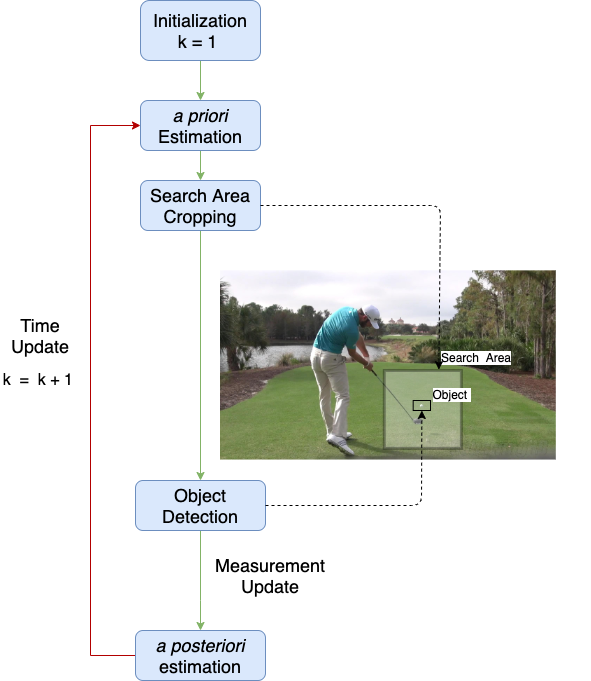
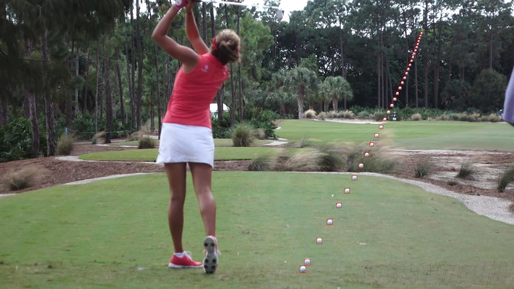
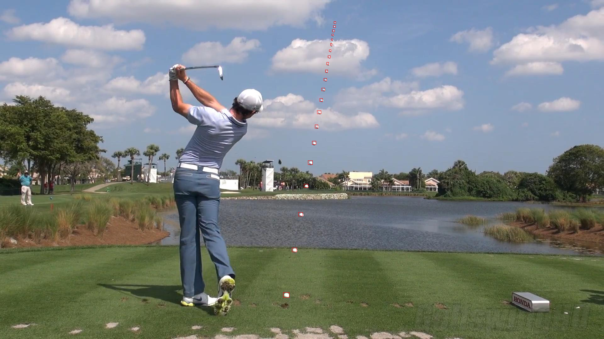

# Efficient Golf Ball Detection and Tracking Based on Convolutional Neural Networks and Kalman Filter 

We borrow the codes and implementations from [jwyang-faster-rcnn.pytorch](https://github.com/jwyang/faster-rcnn.pytorch/tree/pytorch-1.0), and the Pytorch version is 1.0. Please refer to [jwyang-faster-rcnn.pytorch](https://github.com/jwyang/faster-rcnn.pytorch/tree/pytorch-1.0) for more details of setups and implementations.

## Approach
Below is the framework of proposed method:

## Dataset
The dataset link is [golf_ball](https://drive.google.com/file/d/10pzr6mDQPlrylIHg8CdXzHkF4WBMZxfn/view?usp=sharing).

## Results
Some tracking results are shown below:

## Citation

    @article{zhang2020efficient,
      title={Efficient Golf Ball Detection and Tracking Based on Convolutional Neural Networks and Kalman Filter},
      author={Zhang, Tianxiao and Zhang, Xiaohan and Yang, Yiju and Wang, Zongbo and Wang, Guanghui},
      journal={arXiv preprint arXiv:2012.09393},
      year={2020}
    }
    
    
    @inproceedings{zhang2020real,
      title={Real-time golf ball detection and tracking based on convolutional neural networks},
      author={Zhang, Xiaohan and Zhang, Tianxiao and Yang, Yiju and Wang, Zongbo and Wang, Guanghui},
      booktitle={2020 IEEE International Conference on Systems, Man, and Cybernetics (SMC)},
      pages={2808--2813},
      year={2020},
      organization={IEEE}
    }
